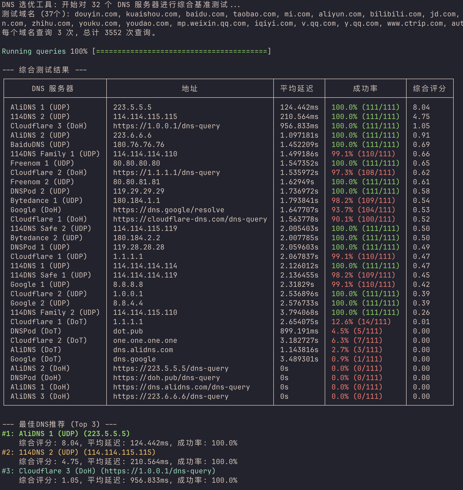

# DNS Optimizer 🚀

[](https://github.com/palemoky/dns-optimizer/actions)
[](https://goreportcard.com/report/github.com/palemoky/dns-optimizer)
[](https://opensource.org/licenses/MIT)

一个跨平台的智能 DNS 选优工具，为您的网络环境推荐最快、最稳定的 DNS 服务器。


DNS 的响应速度和稳定性直接影响您的上网体验。`dns-optimizer` 通过对一系列预设或自定义的 DNS 服务器进行并发基准测试，并基于对多个常用域名的综合表现进行智能评分，帮助您找到当前网络环境下的最优 DNS 设置。

---

## ✨ 功能特性

*   **跨平台支持**: 完美运行于 Windows, macOS, Linux, Raspberry Pi (ARM/ARM64) 等主流平台。
*   **并发测试**: 利用 Go 语言的强大并发能力，在短时间内完成对所有服务器的大量测试。
*   **多协议支持**: 支持传统的 UDP DNS、DNS-over-TLS (DoT) 和 DNS-over-HTTPS (DoH)。
*   **综合评分**: 不仅仅是测速！通过对一组常用域名（如百度、淘宝、Bilibili 等）进行多次查询，结合**平均延迟**和**成功率**给出综合评分。
*   **智能推荐**: 基于综合评分，自动为您推荐 Top 3 的最佳 DNS 服务器。
*   **用户友好的界面**: 清晰的进度条、等待动画和美观的彩色表格，提供专业的命令行工具体验。
*   **高度可定制**: 支持通过命令行参数自定义测试域名列表和每个域名的查询次数。

---

## 📸 运行截图

  

**文本版演示:**
```
DNS 选优工具: 开始对 32 个 DNS 服务器进行综合基准测试...
测试域名 (7个): baidu.com, taobao.com, douyin.com, bilibili.com, jd.com, qq.com, github.com
每个域名查询 3 次, 总计 672 次查询。

Running queries |██████████████████████████| 672/672 (100%) [7s:0s] 

⠹  正在聚合和计算评分...

--- 综合测试结果 ---
+--------------------+-----------------+------------+----------------+------------+
|     DNS服务器       |       地址      |  平均延迟   |      成功率     |  综合评分   |
+--------------------+-----------------+------------+----------------+------------+
| AliDNS 1 (UDP)     | 223.5.5.5       | 9.123ms    | 100.0% (21/21) |   109.61   |
| DNSPod 2 (UDP)     | 119.29.29.29    | 11.456ms   | 100.0% (21/21) |    87.29   |
| 114DNS 1 (UDP)     | 114.114.114.114 | 13.789ms   | 100.0% (21/21) |    72.52   |
| Cloudflare 1 (UDP) | 1.1.1.1         | 25.123ms   | 95.2% (20/21)  |    38.40   |
+--------------------+-----------------+------------+----------------+------------+

--- 最佳DNS推荐 (Top 3) ---
#1: AliDNS 1 (UDP) (223.5.5.5)
    综合评分: 109.61, 平均延迟: 9.123ms, 成功率: 100.0%
#2: DNSPod 2 (UDP) (119.29.29.29)
    综合评分: 87.29, 平均延迟: 11.456ms, 成功率: 100.0%
#3: 114DNS 1 (UDP) (114.114.114.114)
    综合评分: 72.52, 平均延迟: 13.789ms, 成功率: 100.0%
```

---

## 📦 安装

您可以直接从 [GitHub Releases](https://github.com/palemoky/dns-optimizer/releases) 页面下载适用于您操作系统的预编译版本。

1.  前往最新的 Release 页面。
2.  根据您的操作系统和 CPU 架构下载对应的压缩包（例如 `dns-optimizer-windows-amd64.zip`）。
3.  解压后即可直接在终端中使用。

为了方便使用，建议将解压后的可执行文件移动到您系统的 `PATH` 环境变量所包含的目录中（例如 `/usr/local/bin` 或 `C:\Windows\System32`）。

---

## 🚀 使用方法

直接运行即可开始测试：
```bash
./dns-optimizer
```

**自定义参数:**

您可以通过命令行参数自定义测试行为。

```bash
# 查看所有可用参数
./dns-optimizer --help

# 示例：每个域名查询5次，并使用自定义的域名列表
./dns-optimizer -q 5 -d "google.com,github.com,youtube.com"

# 示例：将单次查询超时设为 1 秒，并把并发服务器数降到 8
./dns-optimizer -t 1s -c 8
```

| 参数 | 简写 | 描述 | 默认值 |
|---|---|---|---|
| `--domains` | `-d` | 用于测试的域名列表，以逗号分隔（自动去重） | `baidu.com,douyin.com,...` |
| `--queries` | `-q` | 每个域名的查询次数 | `3` |
| `--timeout` | `-t` | 单次查询超时时间 | `2s` |
| `--concurrency` | `-c` | 同时测试的服务器数量上限 | `16` |
